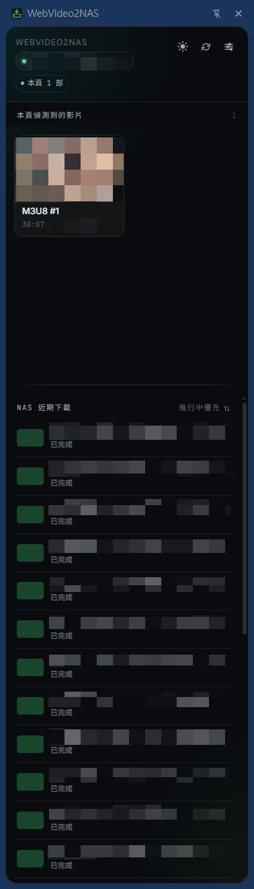

# WebVideo2NAS

[](https://opensource.org/licenses/MIT)
[](https://docs.docker.com/compose/)
[](https://www.python.org/)
[](https://developer.chrome.com/docs/extensions/)
[](https://github.com/asdfghj1237890/WebVideo2NAS/releases/latest)

**Languages**: **English** (`README.md`) | **繁體中文** (`README.zh-TW.md`)

> Seamlessly capture web video URLs (M3U8 and MP4) from Chrome and download them to your NAS — even when sites disguise streams with non-standard URLs

> [!IMPORTANT]
> This project does **not** guarantee every video can be downloaded. Some sites use DRM, expiring URLs, anti-hotlinking, IP restrictions, or change their delivery logic at any time.

> [!CAUTION]
> It is **not recommended** to expose this service directly to the public internet. Prefer accessing your NAS over your **LAN** or via **VPN** (e.g. **Tailscale**).

## Table of Contents

- [Overview](#overview)
- [Quick Links](#quick-links)
- [Key Features](#key-features)
- [Technology Stack](#technology-stack)
- [Project Structure](#project-structure)
- [Requirements](#requirements)
- [Getting Started / Installation](#installation)
- [Usage](#usage)
- [Configuration](#configuration)
- [Security](#security)
- [Limitations](#limitations)
- [Troubleshooting](#troubleshooting)
- [Contributing](#contributing)
- [License](#license)
- [Changelog](#changelog)
- [Support](#support)

## Overview

This system enables you to:
1. 🔍 Detect M3U8 and MP4 video URLs in Chrome (including disguised streams)
2. 📤 Send URLs to your NAS with one click
3. ⬇️ Automatically download and convert to MP4
4. 💾 Store videos on your NAS storage

## System Architecture

```
Chrome Extension → NAS Docker (API + Worker) → Video Storage
```


### Backend Architecture


## Quick Links


<p align="right"><sub>Chrome Extension Interface (Click to view full size)</sub></p>

- **[🚀 Installation Guide](#installation)** - Complete setup instructions
- **[📋 Technical Documentation](docs/)** - Architecture & specifications
- **[🔒 Security Policy](#security)** - Security guidelines
- **[🤝 Contributing](#contributing)** - How to contribute


## Key Features

### Chrome Extension
- ✅ Automatic M3U8 and MP4 URL detection
- ✅ Deep manifest interception — detects disguised streams (e.g. `.jpg`-wrapped HLS) via fetch/XHR content inspection
- ✅ One-click send to NAS
- ✅ Side panel interface for easy access
- ✅ Real-time download progress
- ✅ Cookie & header forwarding for authenticated streams
- ✅ Context menu integration
- ✅ Configurable NAS endpoint

### NAS Docker Service
- ✅ RESTful API for job management
- ✅ **Dual-worker architecture** for parallel processing
- ✅ Multi-threaded segment downloader
- ✅ FFmpeg-based video merging
- ✅ Job queue with Redis
- ✅ Progress tracking & notifications
- ✅ Persistent storage with PostgreSQL

## Technology Stack

**Frontend:**
- Chrome Extension (Manifest V3)
- JavaScript ES6+

**Backend:**
- Python 3.11+ (FastAPI)
- FFmpeg
- Redis
- PostgreSQL
- Docker & Docker Compose

<br clear="both">

## Project Structure

```
webvideo2nas/
├── chrome-extension/  # Chrome extension source
├── docs/              # Documentation
├── video-downloader/  # NAS downloader (Docker stack)
│   └── docker/        # Docker services (API + Worker)
├── pics/              # Diagrams used by README
└── README.md          # This file
```

## Requirements

### For NAS
- Docker & Docker Compose
- 2GB+ RAM available
- Storage space for videos
- Network accessibility from Chrome device

### For Chrome
- Chrome browser (v88+)
- Developer mode enabled (for unpacked extension)

## Getting Started

<a id="installation"></a>
### 📦 Installation

**Prerequisites:** Docker 20.10+, Docker Compose v2, 2 GB+ RAM. Chrome must reach the NAS over the LAN.

The actual application ships as a single multi-arch container at `ghcr.io/asdfghj1237890/webvideo2nas` (linux/amd64 + linux/arm64). The release zip contains **only the compose file** (~3 KB).

#### 1. Get the compose files

```bash
wget https://github.com/asdfghj1237890/WebVideo2NAS/releases/latest/download/WebVideo2NAS-downloader-docker.zip
unzip WebVideo2NAS-downloader-docker.zip       # → ./docker/
cd docker
```

Pick the right compose file for your host:

| Host | Run |
|---|---|
| **Synology NAS** | `mv docker-compose.synology.yml docker-compose.yml` |
| **Anything else** (Linux / macOS / Windows Docker) | `mv docker-compose_not_synology.yml docker-compose.yml` |

> Synology paths are hard-coded as `/volume1/...` (DB, Redis, downloads, logs). Adjust the `volumes:` section if your layout differs.

#### 2. Set up `.env`

```bash
cp .env.example .env
```

Edit `.env` and set the **two required** values:

| Variable | How |
|---|---|
| `API_KEY` | `openssl rand -base64 32` — also paste this into the Chrome extension settings |
| `DB_PASSWORD` | `openssl rand -base64 24` |

All other variables ship with sensible defaults; comments in `.env.example` describe each (rate limiting, CORS, worker tuning, IP allowlist, SSRF guard, image tag pin).

#### 3. Start the stack

```bash
docker compose pull       # pulls ghcr.io/asdfghj1237890/webvideo2nas:latest
docker compose up -d
curl -fsS -H "Authorization: Bearer YOUR_API_KEY" http://localhost:52052/api/health
# → {"status":"healthy"}
```

> Pin a specific image version: set `IMAGE_TAG=1.9.2` in `.env` (defaults to `latest`).

<details>
<summary><strong>Synology Container Manager (DSM UI alternative to CLI)</strong></summary>

If you'd rather not SSH:

1. **Package Center** → install **Container Manager** (skip if already installed).
2. **File Station** — create / verify these paths and grant the project user read/write:
   - `/volume1/docker/video-downloader/` (project root: extract zip here, place `.env`)
   - `/volume1/docker/video-downloader/db_data/` (DB persistence)
   - `/volume1/docker/video-downloader/redis_data/` (Redis persistence)
   - `/volume1/docker/video-downloader/logs/` (logs)
   - `/volume1/video-downloader/downloads/` (downloaded videos — adjust the path to match your shared folder, and update the compose file's `volumes:` if it differs)
3. **Upload + extract** `WebVideo2NAS-downloader-docker.zip` to `/volume1/docker/video-downloader/` (gives `/volume1/docker/video-downloader/docker/`).
4. **Edit `.env`** in DSM Text Editor (or upload from PC) — set `API_KEY` + `DB_PASSWORD`.
5. **Container Manager → Projects → Create**:
   - Project name: `video-downloader`
   - Path: `/volume1/docker/video-downloader/docker`
   - Source: pick `docker-compose.synology.yml`
   - Finish the wizard — DSM auto-pulls the image from GHCR and brings everything up.
6. **Verify**: `http://YOUR_SYNOLOGY_IP:52052/api/health` (with `Authorization: Bearer ...`) returns `{"status":"healthy"}`.

</details>

#### 4. Install the Chrome extension

1. Clone the repo, or download `WebVideo2NAS-chrome-extension.zip` from the same release and unzip.
2. `chrome://extensions/` → enable **Developer mode**.
3. **Load unpacked** → select the `chrome-extension/` folder.
4. Open the extension **Settings**:
   - **NAS Endpoint**: `http://YOUR_NAS_IP:52052` (use the LAN IP, not `localhost`)
   - **API Key**: same value as `API_KEY` in `.env`
5. **Test Connection** → should say *connected*.

#### Updating

```bash
cd /path/to/docker-compose-folder
docker compose pull
docker compose up -d
```

Synology UI: open the Project → **Action → Pull** → **Restart**.

#### Common issues

| Symptom | Likely cause |
|---|---|
| `/api/health` returns **401** | `Authorization: Bearer <API_KEY>` header missing or mismatched against `.env` |
| Worker container shows **unhealthy** | Pre-1.9.2 templates inherit the API healthcheck. Upgrade to ≥ 1.9.2 (`docker compose pull`) — fixed compose disables the inherited check |
| Synology can't write to `/downloads` | Check folder permissions in DSM File Station (project user needs read/write) |
| Anything else | See [Troubleshooting](#troubleshooting) |

## Usage

1. Browse to any video streaming site
2. When video URL (M3U8/MP4) is detected, extension badge shows notification
3. Click extension icon to open side panel, or right-click → "Send to NAS"
4. Video downloads automatically to your NAS (with cookies for authenticated streams)
5. Monitor progress in the side panel
6. Access completed videos in `/downloads/` (or `/downloads/<subdir>/` if a per-profile subfolder is configured)

## Configuration

### Environment Variables

The full list with inline comments lives in [`.env.example`](video-downloader/docker/.env.example). The two **required** values are `API_KEY` and `DB_PASSWORD`; everything else has sensible defaults. The handful you'll most likely tune:

| Variable | Default | Effect |
|---|---|---|
| `IMAGE_TAG` | `latest` | Pin to a specific release (e.g. `1.9.2`) instead of tracking latest |
| `LOG_LEVEL` | `INFO` | `DEBUG` for verbose troubleshooting; `WARNING` to quiet down |
| `MAX_DOWNLOAD_WORKERS` | `20` | Per-worker thread pool for HLS segment downloads |
| `FFMPEG_THREADS` | `2` | Threads ffmpeg uses during merge |
| `RATE_LIMIT_PER_MINUTE` | `10` | Per-IP API rate limit (0 disables) |
| `ALLOWED_CLIENT_CIDRS` | _(empty)_ | Comma-separated CIDRs permitted to call the API; empty = no restriction |
| `SSRF_GUARD` | `false` | `true` blocks downloads targeting private/loopback/link-local hosts |
| `CLEANUP_INTERVAL_SECONDS` | `3600` | How often `db_cleanup` prunes finished jobs (keeps latest 100) |

### Worker Scaling

The default compose runs **2 download workers**. For higher throughput copy the `worker2` block into `worker3` / `worker4` / etc. For lower-spec hosts delete the `worker2` service.

### Extension Settings

In `chrome://extensions/` → **WebVideo2NAS** → **Settings**:
- **NAS Endpoint**: `http://YOUR_NAS_IP:52052` (LAN IP, not `localhost`)
- **API Key**: same value as `API_KEY` in `.env`
- **Auto Detect**: surfaces M3U8/MP4 URLs as you browse
- **Notifications**: completion alerts

## Security

⚠️ **Important:**
- **Don't expose this service directly to the public internet.** Keep it on your LAN, or behind a VPN (Tailscale, WireGuard, etc.).
- Keep `API_KEY` secret. Generate strong: `openssl rand -base64 32`. Never commit `.env`.
- For tighter access control, set `ALLOWED_CLIENT_CIDRS` to your LAN range and `SSRF_GUARD=true`.
- Pin `IMAGE_TAG` to a specific version and review the changelog before upgrading.
- Out of scope: DRM bypass, public-internet hosting, multi-tenant deployments.

### Reporting a Vulnerability

Please open a [GitHub Security Advisory](https://github.com/asdfghj1237890/WebVideo2NAS/security/advisories/new). **Do not** open a public issue.

When reporting, include: type of issue, affected file path / commit, reproduction steps, and (if possible) PoC and impact assessment.

## Limitations

- ❌ DRM-protected content not supported
- ❌ Some streaming sites use additional encryption
- ❌ Requires network connectivity between Chrome and NAS
- ℹ️ Download speed limited by network and NAS hardware

## Troubleshooting

For first-run / install issues see the [Common issues table](#common-issues) at the end of Installation.

### Extension can't connect to NAS
- `http://YOUR_NAS_IP:52052` — use the LAN IP, not `localhost`
- `docker compose ps` — confirm `video_api` is `Up` and `(healthy)`
- Synology / Linux firewall blocking 52052?

### Download fails
- `docker compose logs -f worker` — failure reason is usually one error line
- For authenticated streams: confirm the extension captured cookies for the manifest's domain (extension Settings → check the captured-headers panel)
- HTTP 403/474 from segment downloads usually means the URL has expired — re-detect from a fresh page load
- Disk full? `df -h /downloads`

### Slow downloads
- Lower `MAX_DOWNLOAD_WORKERS` in `.env` (NAS CPU saturated)
- The site may be throttling; check segment download rate in worker logs
- Network: verify NAS upload bandwidth from another LAN device

## Contributing

PRs welcome.

1. Fork → branch (`feature/...` or `fix/...`)
2. Run the test suite locally — same as CI:
   - Python: `bash video-downloader/docker/tests/run_upgrade_check.sh`
   - Extension: `cd chrome-extension && npm test`
3. Open a PR against `main` with a clear description and link any related issue

**Code style:** Python follows PEP 8 + type hints; JavaScript is ES6+ with `const`/`let` and async/await. Match the surrounding file. No formatter is enforced.

**Project layout:** see [Project Structure](#project-structure) above. Architecture docs and API specs live in [`docs/`](docs/).

**Reporting issues:** open a [GitHub Issue](https://github.com/asdfghj1237890/WebVideo2NAS/issues) with reproduction steps, expected vs actual behavior, and environment details (OS, Docker version, NAS model). For security issues see [Reporting a Vulnerability](#reporting-a-vulnerability) — do **not** open a public issue.

By contributing you agree to license your work under the MIT License.

## License

MIT License — see [LICENSE](LICENSE).

<a id="changelog"></a>
## Changelog

All notable changes to this project will be documented in this file.

The format is based on [Keep a Changelog](https://keepachangelog.com/en/1.0.0/),
and this project adheres to [Semantic Versioning](https://semver.org/spec/v2.0.0.html).

<details>
<summary><strong>Full Changelog (click to expand)</strong></summary>

### [2.1.20] - 2026-05-04

#### Fixed
- **Multi-tab URL substitution sent the wrong video.** When the user clicked Send on a tile from Tab A while currently viewing Tab B, the captured-headers picker scored every Tab B manifest +10 (because it called `chrome.tabs.query({active:true,currentWindow:true})` to get the "current" tabId — which is Tab B, not the URL's source tab). With the +10 weight dominating, `shouldUseBest` then OVERWROTE the URL the user actually clicked with whichever Tab B manifest scored highest, silently sending a video from a completely different site. Replaced the tabId-based scoring with **source-page origin matching** — the URL's source `pageUrl` is already passed through with the click, and a captured manifest's `entry.initiator` carries the page that triggered the request, so we can compare them directly without ever calling `chrome.tabs.query`. Also added a hard same-origin guard on the substitution itself: even if a captured entry scores high, it can only replace the user's clicked URL if it shares either (a) the source page's origin via initiator, or (b) the same URL origin as what the user clicked. Origin is intrinsic to the URL and survives tab switches/close/reopen, where tabId is a transient identifier the user can never see — making this both correct and tab-switch-immune. Verified with a two-tab simulation: old logic returned Tab B's URL when the user clicked Tab A's; new logic returns Tab A's tokenized variant as expected
- Removed the now-unused `getActiveTabId()` helper and dropped the `tabId` parameter from `findBestCapturedEntry()`

### [2.1.19] - 2026-05-04

#### Fixed
- **`OSError: [Errno 36] File name too long` on long Japanese / CJK titles**, killing the merge step after the user had already burned bandwidth downloading 1228 segments. The Linux ext4/btrfs single-filename limit is 255 bytes, but every Japanese character is 3 bytes UTF-8, so a ~90-character title encodes to ~270 bytes and overflows. Worker's `safe_title` sanitization had no length cap, and the chrome extension's `.substring(0, 100)` cap counts *characters* not bytes — neither protected against this. Added a module-level `_make_safe_filename_stem()` helper that sanitizes and then truncates to **240 UTF-8 bytes** (leaves headroom for `.mp4`/`.mov` and a ` (NN)` collision suffix under the 255-byte limit), walking back to a UTF-8 character boundary so it never slices inside a multi-byte sequence. Used by all three filename construction sites (MPD, direct download, m3u8). Verified with the failing real-world title: 256 bytes → 240 bytes truncated cleanly at a character boundary, full path with `.mp4` + ` (99)` suffix → 249 bytes ≤ 255
- Worker / API version markers: `1.10.4` → `1.10.5`; extension manifest: `2.1.18` → `2.1.19` (worker fix needs a rebuilt docker image to take effect)

### [2.1.18] - 2026-05-04

#### Fixed
- **IP-restricted URL warning blew up tile height in narrow grid columns.** The `.ip-warn` block rendered its full ~140-character explanatory body inline in the tile, so in a `isMany` 3-column layout the text wrapped to 25+ lines and the tile holding an IP-restricted URL became 5–6× taller than its siblings, wrecking grid alignment. Reworked as a `<details>` collapsible matching the failed-job error pattern: collapsed default shows a single-line summary (`! IP-Restricted URL Detected ▶`) bounded by `white-space: nowrap`, click to expand the full guidance. Tile heights stay even, the warning is still discoverable, and the body uses `white-space: pre-line` so the i18n body's intentional newlines are preserved when expanded

### [2.1.17] - 2026-05-04

#### Fixed
- **"After ~15 pending jobs, no Send goes through" — actually a 429 rate-limit hit, not a black hole.** The compose templates and `.env.example` defaulted `RATE_LIMIT_PER_MINUTE=10`, which counts /api/download in the write bucket (multiplier 1) over a 60-second clock window. Once the user fired 10+ submissions in a minute, every additional one returned `429 "Rate limit exceeded"` — but the chrome extension surfaced this through the same low-priority `chrome.notifications.create` call as everything else, so during a bulk-send burst the 5–10 stacked rate-limit notifications got collapsed/missed and the user just saw clicks vanishing. Three changes: (1) bumped default `RATE_LIMIT_PER_MINUTE` from 10 → 60 in `docker-compose_not_synology.yml`, `docker-compose.synology.yml`, `.env.example`, and `SYNOLOGY_DEPLOY_COMMANDS.md` — 60/min is sensible for a private NAS while still rate-limiting public exposure; (2) the API's 429 detail now spells out the actual limit, the env var name, and how to raise it (`"Rate limit exceeded (write: 60 requests/min). Raise RATE_LIMIT_PER_MINUTE in .env (currently 60) and restart the api container, or wait for the next minute window."`) so the chrome extension's notification carries actionable info; (3) the extension tags 429 errors and shows them via a dedicated sticky notification (priority 2, `requireInteraction: true`, fixed id so duplicates collapse into one card), making the rate-limit hit unmissable instead of one of ten flashing toasts
- Worker / API version markers: `1.10.3` → `1.10.4`; extension manifest: `2.1.16` → `2.1.17`

#### Migration
- Existing deployments need to update `.env` if they have `RATE_LIMIT_PER_MINUTE=10` set explicitly (the new default only kicks in if the var is unset). Bump to 60 (or higher for purely private NAS) and restart the api container

### [2.1.16] - 2026-05-04

#### Fixed
- **"Occasionally clicked Send but no submission landed."** `flyToNAS()` was firing the actual NAS request *inside* the 700 ms fly-ghost animation `setTimeout`, so the click → real-send latency was 700 ms (and ~1.4 s for the last item in a bulk-send of 10). Anything that killed the sidepanel's JS context during that window — closing the side panel, browser idle suspension, navigation — also killed the queued setTimeout, and the `sendToNAS` call never fired. Even when the request did go through, a `loadDetectedUrls()` triggered by a new background-detected URL between click and animation end re-rendered the grid using a stale `sentUrls` (the click hadn't yet recorded the URL as sent), so the new tile rendered without `.sent` and the user assumed nothing happened. Refactored `flyToNAS()` to fire `sendToNAS()` and update `sentUrls`/`selected` *immediately* on click, then run the visual ghost flight in parallel. The request is now in flight before the animation even starts; closing the sidepanel mid-animation no longer drops anything; mid-animation re-renders pick up the correct `.sent` state

### [2.1.15] - 2026-05-04

#### Fixed
- **Deselect on a sent tile produced no visible change** ("送出之後想 deselect 看不出來"). The previous selected style used `--accent-dim` and a faint 1 px ring — both got visually eaten by the `.sent` state, which already paints a full-strength mint border, an inset mint outline, and a mint background tint from the same accent family. Toggling `.selected` off a `.sent` tile changed nothing the eye could detect. The selected style now paints rings that live OUTSIDE `.sent`'s territory: a 2.5 px full-strength accent ring + a near-white halo ring (dark halo on light theme) + a soft drop glow, plus a small lift+scale transform for tactile toggle feedback. The two states are now layerable — a sent+selected tile shows BOTH the mint .sent fill and the bright outer selection ring, so toggling the selection is unmistakable

### [2.1.14] - 2026-05-04

#### Changed
- **Selectable-tile state was hard to read at a glance.** In bulk-select mode (≥7 detected videos) the empty checkbox was an 18×18 dim translucent square that read more like a media-overlay glyph than an interactive control on busy thumbnails, and the unselected vs. selected tile bodies looked nearly identical except for a subtle accent border. Two changes: (1) the empty `.sel-dot` is now 22×22 with a 2 px high-contrast white ring (dark ring on light theme), an inner contrast halo, and a stronger drop shadow so it stays unmistakably checkbox-shaped on every thumbnail; (2) when *any* tile is selected, the thumbnail + meta of every unselected sibling fades to 45% opacity (hover lifts to 85%) — the picked-vs-unpicked split now reads instantly. The sel-dot itself stays at full opacity over the dimmed thumbnail, so the empty checkbox remains a prominent click target (mac/iOS Photos pattern). Implemented as pure CSS via `:has()` — no JS state changes

### [2.1.13] - 2026-05-04

#### Fixed
- **Bulk-send still dropped 1–2 of 10 even after the v2.1.12 receiver-side fix**, because the *sender* side (`sidepanel.js → chrome.runtime.sendMessage(...)`) fired-and-forgot without ever awaiting the response or retrying transient delivery errors. The first 1–2 messages of a burst routinely lose to MV3's SW cold-start race ("Could not establish connection. Receiving end does not exist.") — the listener isn't registered yet, the message never reaches the handler, and there's no second attempt. Added a `sendMessageWithRetry()` helper with up to 4 attempts and 50→150→350 ms exponential backoff (≤ 550 ms total before giving up), targeting only the three known transient MV3 messaging errors (cold listener, port closed mid-handler, extension context invalidated). Verified with a cold-listener simulation: 5/5 messages delivered with retry vs 0/5 without
- **API `submit_download` blocked the FastAPI event loop** by being declared `async def` while the body uses sync SQLAlchemy + sync redis (`db.execute(...)`, `redis_client.rpush(...)`). Each in-flight request serialised the next one's I/O behind it, compounding latency under concurrent burst load and making the SW more likely to terminate before some sends could complete the round trip. Demoted to plain `def` so FastAPI runs each invocation in the threadpool (default 40 threads) and 10+ concurrent submissions parallelise cleanly. (`list_jobs`/`get_job`/etc. are still `async def` — they're not on the burst-submit path, separate cleanup later.)
- Worker / API version markers: `1.10.2` → `1.10.3`; extension manifest: `2.1.12` → `2.1.13`

### [2.1.12] - 2026-05-04

#### Fixed
- **Send-from-multiple-tabs in quick succession dropped 1–2 of N requests** silently. The MV3 background service worker's `sendToNAS` message handler called `sendResponse({success:true})` synchronously and returned without `return true`, so Chrome considered the handler done the moment it returned and the SW became eligible for shutdown between the awaits inside `sendToNAS` (`storage.get` → `cookies.getAll` → `fetch`). The first 1–2 sends landed inside the active SW window; later sends lost their in-flight Promise chains to SW termination and never reached the NAS. Handler now returns `true` and defers `sendResponse` until `sendToNAS` settles, keeping the message channel — and therefore the SW — alive
- **`storeJob` lost concurrent writes** to the local jobs list (read snapshot → unshift → write back, with no serialisation). Internal bookkeeping today, but the symptom would resurface the moment any UI started reading from it. Calls now flow through a single-slot promise chain so reads and writes don't interleave (verified: 10 concurrent `storeJob`s → 10 entries saved, max concurrent storage ops = 1)
- Extension `manifest.json` version: `2.1.10` → `2.1.12` (skipping `2.1.11` since that tag was the metadata-only version-marker bump)

### [2.1.10] - 2026-05-04

#### Fixed
- **`Error: [object Object]` notification after sending a `.mov` video**: v2.1.9 added `.mov` support to the chrome-extension and worker but missed the API's pydantic URL validator (`api/main.py`). The first `.mov` URL therefore got 422'd by FastAPI, and the chrome-extension's `new Error(error.detail)` stringified the validation-error array straight into `"[object Object]"`. The validator now accepts `.mov` (and `'mov'` as a `format` hint), and the extension routes API errors through a new `formatApiErrorDetail()` helper that handles all FastAPI shapes (string `detail`, validator-error array, object, missing) — multi-error 422s now read like `"url: field required; title: too short"` instead of vanishing
- **Worker / API version markers**: `1.10.1` → `1.10.2` (server-side change, requires rebuilt docker image to take effect)

### [2.1.9] - 2026-05-04

#### Added
- **Direct `.mov` (progressive QuickTime) downloads end-to-end**: previously the extension only detected `.m3u8`/`.mpd`/`.mp4` URLs and the worker only routed `.mp4` to the direct-download path, so MOV files served as a single Range-request resource (e.g. `https://lurl6.lurl.cc/.../*.mov`) never made it into the side panel and could not be sent. `background.js`/`sidepanel.js` now whitelist, score, classify, and colour `.mov` like `.mp4`. The worker's `is_direct_download` predicate was refactored into a small per-extension helper and runs for both `.mp4` and `.mov`, and the output filename now keeps the source extension (`.mov` stays `.mov`) instead of being forced to `.mp4`. Tests cover `.mov` acceptance and the `*.mov.jpg` false-positive trap

### [2.1.8] - 2026-05-04

#### Changed
- **Default Recent Jobs sort flipped to failed-first**. After v2.1.6/v2.1.7 the worker correctly marks token-expiry / aborted jobs as `failed` instead of silently shipping stub MP4s, but with the previous `active`-first default those failures could scroll out of view as new jobs queued up. The default is now `failed` — it's what the user wants to see when something went wrong. Users who explicitly chose `active` in the past keep their preference; only the unset/legacy case changes. `JOB_SORT_CYCLE` flipped to `['failed', 'active']` so cycling reflects the new default order

### [2.1.7] - 2026-05-04

#### Fixed
- **CDN-token-expiry surfaced as a real failure instead of a silent retry loop**. v2.1.6 made the worker raise on expired CDN tokens, but the rest of the pipeline didn't know what to do with the new error strings: the abort-detection in `_handle_job_failure` was looking for the brittle substring `"403/474 errors"` / `"URL expired or blocked"`, so the new `"Download aborted: only X/Y segments succeeded …"` message matched neither and was getting re-queued for `MAX_RETRY_ATTEMPTS` retries (pointless — the token is dead). The chrome-extension also classified these errors as either generic ("Download Failed") or — worse — as `403` (whose solution text is about IP-based auth, totally unrelated). Worker now treats any `"Download aborted: …"` message as a deliberate give-up (no retry), which also fixes a latent bug where the existing anti-hotlinking abort path was getting retried. Extension adds a new `error.tokenExpired.{type,solution}` key in all 8 locales and matches token-expiry patterns before the generic `403` branch, so users see "CDN Token Expired" with an actionable solution ("refresh source page, re-Send")

### [2.1.6] - 2026-05-04

#### Fixed
- **Anti-leech HLS streams shipped as 5/54-segment stub MP4s reported "completed successfully"**. CDN signed-token URLs (`?auth=…&exp=…`) often serve a few segments before the token expires and the rest 401. Three holes combined to make the worker silently produce a 2.45 MB file labelled as a 392-second video: (1) the early-abort guard in `progress_callback` only counted HTTP `403`/`474`, never `401`; (2) the post-download check was `if not segment_files` — i.e. it only failed on *zero* segments; (3) the cached "working Referer strategy" stuck around even after that strategy started 401-ing for every subsequent segment, wasting one extra request per segment and obscuring the real cause. Worker now: includes `401` in the abort-condition counter (renamed log to `401/403/474`); requires ≥90% segment success after `download_all` (overridable via `MIN_SEGMENT_SUCCESS_RATIO` env var) and cleans up partial segments on failure; invalidates `working_referer_strategy` on first failure and logs a warning that points at signed-URL/token expiry rather than headers

### [2.1.5] - 2026-05-01

#### Fixed
- **Bloated output duration on anti-leech HLS** (e.g. some `*.jpg`-disguised `index.jpg?auth=…` streams): the m3u8 declared 38 s of segments but the merged MP4 played for 1:06. The `.ts` files contain padding past their declared `EXTINF`, and `ffmpeg -f concat -c copy` honours the raw TS PTS rather than the playlist's total — so every segment's padding leaked into the output. The merger now hard-caps output at the playlist's declared duration via `-t <seconds>`, trimming the padding without re-encoding. No effect on well-formed playlists where `EXTINF` already matches TS content
- **Worker / API version markers**: `1.10.0` → `1.10.1` (server-side change, requires rebuilt docker image to take effect)

### [2.1.4] - 2026-04-28

#### Changed
- **`pending` job-status colour** in the side panel was indistinguishable from regular dimmed text (both grey). Pending now uses a new `--info` cyan-blue token (`oklch(78% 0.10 230)` dark, `oklch(55% 0.14 230)` light) — same lightness/chroma as `accent` / `warn` / `err`, distinct hue (230). Queued jobs are now visually scannable

### [2.1.3] - 2026-04-28

#### Changed
- **Bulk-send safety**: when ≥7 videos are detected, the side panel's bulk bar previously defaulted to a `Send all N` action even when nothing was selected — one accidental tap could fan out N NAS jobs. The Send button is now disabled until at least one video is selected; a separate `Select all (N)` / `Clear` toggle is the only way to bulk-select. The Send button label tracks selection count (`Send selected (N)`) and reads `Select to send` while nothing is selected

### [2.1.2] - 2026-04-27

#### Fixed
- **Multi-tab title mismatch**: when several tabs were open, sending a video to NAS could attach the wrong tab's title to the URL — the side panel was using the *active* tab's title at click time instead of the title of the tab where the URL was actually detected. The background service worker now records the page title at URL-detection time and uses that as the source of truth, so switching tabs before clicking *Send* no longer poisons the filename

### [2.1.1] - 2026-04-27

#### Fixed
- Save / discard buttons in the options page status bar appeared "broken" on the profiles and prefs panes (they stayed greyed because dirty-tracking only watches the connection.toml fields). The buttons + unsaved counter are now hidden on auto-save panes; an `↻ auto-saves on edit` hint appears in their place

#### Changed
- Extension `manifest.json` version: `2.0.0` → `2.1.1` (was unintentionally left at `2.0.0` in the v2.1.0 tag — first version where the feature is reflected in the manifest)
- README version footer + changelog brought up to date

### [2.1.0] - 2026-04-27

#### Added
- **Per-profile NAS subfolder**: each profile in the extension can now carry an `output_subdir` (relative path under `/downloads/`). Files land in `/downloads/<subdir>/`; empty = root. Useful for sorting downloads per content category or per NAS share
- Validation runs in three layers (Chrome options UI, FastAPI Pydantic model, worker path resolver). Worker re-checks via `Path.resolve()` + `relative_to()` so DB tampering can't escape `/downloads/`

#### Changed
- **Flatten downloads layout**: worker no longer interposes a `completed/` directory — files now go directly to `/downloads/<subdir>/` (or `/downloads/`). Operators wanting to migrate can `mv` existing files out of `…/downloads/completed/`
- Synology compose template default host path: `/volume1/nsfw_video/video-downloader/downloads` → `/volume1/video-downloader/downloads`
- API internal version bumped to 1.10.0; extension bumped to 2.1.0

#### Migration
- Schema migration runs idempotently from API + worker startup (`ALTER TABLE job_metadata ADD COLUMN IF NOT EXISTS output_subdir TEXT`) — no manual SQL required

### [1.9.2] - 2026-04-26

#### Fixed
- Worker containers were marked **unhealthy** because they inherited the unified image's API healthcheck (`curl http://localhost:8000/api/health`) — workers don't listen on port 8000. The compose templates now explicitly disable the inherited healthcheck on `worker` / `worker2` services

### [1.9.1] - 2026-04-26
> Note: this is the first release of the unified-image flow; v1.9.0 was reserved by an earlier mis-tagged commit and skipped.

#### Changed
- **Unified Docker image**: api + worker now ship as a single multi-arch image (`linux/amd64` + `linux/arm64`) at `ghcr.io/asdfghj1237890/webvideo2nas`. Services dispatch by `ROLE` env var (`api` / `worker`)
- **GHCR distribution**: release zip slimmed to ~3 KB (compose + init-db.sql + .env.example only) — users `docker compose pull` instead of building from source
- **Hash-locked Python deps**: `requirements.txt` regenerated via `pip-compile --generate-hashes`; `pip install --require-hashes` blocks supply-chain swaps
- Sequential release workflow: GitHub Release is gated on the matching GHCR image being live, so `docker compose pull` immediately after the release email never 404s

#### Security
- **Fix `/api/health` auth bypass via spoofed `X-Forwarded-For: 127.0.0.1`**: the endpoint now requires the API key for all callers; the in-container Docker `HEALTHCHECK` sends it via Authorization header

#### Removed
- Dropped unused dependencies `aiohttp` and `aiofiles` (never imported by api or worker code)

#### Build
- Multi-arch image build with provenance attestation + SBOM (`docker/build-push-action@v6`)

### [1.8.9] - 2026-04-03

#### Fixed
- Fix **HTTP 400 Bad Request** when downloading m3u8 streams from sites that store video playback progress as URL-like cookies (e.g. `https://…/index.m3u8=1234`). These non-standard cookie entries bloated the `Cookie` header beyond server limits; the worker now strips them before sending requests

### [1.8.8] - 2026-03-11

#### Added
- **Deep manifest interception** (`inject.js`): New MAIN-world content script that patches `fetch()` and `XMLHttpRequest` to inspect the first bytes of every response for `#EXTM3U` signatures — catches HLS manifests served from arbitrary URLs without `.m3u8` extension or correct MIME type (e.g. sites that disguise streams as `.jpg`)
- **Response Content-Type detection**: Identify HLS manifests by `Content-Type` header regardless of URL extension
- `format` hint field in download API — allows the extension to tell the backend the stream type even when the URL has no recognizable extension

#### Changed
- `sendToNAS()` accepts URLs detected by Content-Type or content interception (not just URL pattern)
- NAS API validator uses `model_validator` to allow `format` hint to bypass URL pattern check

#### Fixed
- **Rate limit no longer blocks normal usage**: Read-only endpoints (job list, job status) now use a separate, higher rate-limit bucket so side panel polling no longer starves download requests

### [1.8.6] - 2026-01-13

#### Added
- Implement video interaction tracking in Chrome extension to improve video detection

#### Changed
- Refactor background tests for video interaction logic

#### Docs
- Add Traditional Chinese translation (`README.zh-TW.md`)
- Enhance README with usage and troubleshooting details
- Clarify permissions and environment variable setup
- Update safety warnings and directory structure documentation

### [1.8.5] - 2025-12-16

#### Added
- Add GitHub Actions CI workflow for Python unit tests (API + worker via `uv`), Chrome extension unit tests (Vitest), and an API smoke test using Docker Compose
- Add unit tests for Chrome extension helpers and downloader worker/API edge cases

#### Changed
- Exclude tests, `node_modules`, and Python caches from release zip artifacts

#### Fixed
- Fix side panel quality extraction so adjacent quality markers (e.g. `720p_1080p`) are detected reliably
- Make M3U8 parsing more robust: handle `Accept-Encoding: br` case-insensitively and ignore invalid AES-128 IV values

#### Docs
- Update API specification to remove `/api/auth/validate` endpoint

### [1.8.4] - 2025-12-16

#### Changed
- Improve video URL detection and Chrome extension UI behavior
- Update deployment instructions and Docker Compose configuration for the downloader stack
- Rename downloader directory from `m3u8-downloader/` to `video-downloader/` and update related configuration references
- Bump project version to `1.8.4` across Chrome extension, API, worker, and docs

#### Docs
- Update installation/examples to use `video-downloader/` and `video_*` container names (remove legacy `m3u8-*`)

### [1.8.3] - 2025-12-16

#### Added
- Add `db_cleanup` service to prune finished jobs (keep latest 100) on an interval via `CLEANUP_INTERVAL_SECONDS`

#### Changed
- Align Docker Compose names and database to `video_*` / `video_db` for both standard and Synology deployments

#### Docs
- Update Project Structure tree to match repository layout
- Document `CLEANUP_INTERVAL_SECONDS` in `.env.example`

#### Fixed
- Side panel now picks up updated NAS settings without getting stuck, and shows a more specific connection error reason
- GitHub release workflow updated to use the renamed `video-downloader/` directory

### [1.8.1] - 2025-12-16

#### Changed
- Documentation updates

### [1.8.0] - 2025-12-16

#### Added
- User settings for auto-detection and notifications
- SSRF protection and client IP allowlisting in API and worker

#### Changed
- Remove `MAX_CONCURRENT_DOWNLOADS` configuration and update related documentation
- Update environment variables and Docker Compose settings to reflect worker configuration changes

### [1.7.0] - 2025-12-15

#### Added
- Internationalization (i18n) support for side panel and options

#### Changed
- Rename project from "Chrome2NAS M3U8 Downloader" to "WebVideo2NAS"
- Improve video URL detection, handling, and deduplication in the background script

### [1.6.0] - 2025-12-12

#### Changed
- Improve side panel UI and error handling; enhance job status display and duration formatting
- Improve media duration handling in the download worker
- Improve header normalization and M3U8 request handling across extension background and worker
- Enhance downloader encryption handling and session management
- Documentation updates (port usage/spec details) and version display updates

### [1.5.0] - 2025-12-12

#### Added
- Brotli support and header sanitization in the M3U8 parser
- Cooperative cancellation support in `SegmentDownloader`

#### Fixed
- Sidepanel click handling for job actions (use `currentTarget`)

#### Changed
- Improve M3U8 validation and error handling in the worker
- Chrome extension UI/theming refinements and progress text rendering updates
- Release workflow updated to generate changelog and bump version to 1.5.0

### [1.4.3] - 2025-12-02

#### Changed
- Implement enhanced header capturing and Referer strategies in the downloader

### [1.4.1] - 2025-12-02

#### Changed
- Improve error handling and anti-hotlinking protections in downloader/parser modules

### [1.4.0] - 2025-12-02

#### Added
- AES-128 decryption support for encrypted HLS segments
- Download cancellation support with UI status labels and backend handling
- MP4 downloads alongside M3U8

#### Changed
- Legacy SSL support for downloader/parser modules

### [1.1.0] - 2025-10-13

#### Added
- **Expanded to 2 download workers** for parallel processing capability
  - Total system capacity increased to 2 concurrent videos (1 per worker)
  - Automatic load balancing via Redis queue
  - Improved throughput and high availability
- Comprehensive documentation of dual-worker architecture
  - Multi-worker design explanation in docs/ARCHITECTURE.md
  - Worker scaling guidelines in the Installation section of README.md
  - Performance tuning recommendations
  - Load balancing via Redis queue documentation

#### Fixed
- Download failure issues resolved with improved worker architecture
- Enhanced error handling and retry mechanism stability
- Better resource management under high load

#### Changed
- Docker Compose now deploys 2 workers by default (previously 1)

### [1.0.0] - 2025-10-12

#### Added - Phase 3 Complete: Chrome Extension
- Chrome extension with automatic M3U8 URL detection
- One-click send to NAS functionality
- Real-time progress monitoring in extension popup
- Settings page with NAS endpoint configuration
- Context menu integration
- Badge notifications for detected URLs

#### Added - Phase 2 Complete: Video Downloader
- Phase 2 complete: Worker implementation with playlist parsing (M3U8) and direct downloads (MP4)
- FFmpeg integration for video merging
- Multi-threaded segment downloader
- Retry mechanism with exponential backoff
- Comprehensive error handling

#### Changed
- Enhanced worker architecture for better performance
- Improved logging system
- Updated Docker configurations

### [0.1.0] - 2025-10-11

#### Added
- Phase 1 complete: Core infrastructure
- Docker Compose setup for Synology NAS
- PostgreSQL database with schema
- Redis job queue
- FastAPI REST API with basic endpoints
- Worker skeleton with job processing
- Comprehensive documentation
  - Technical specification
  - Architecture documentation
  - Synology setup guides
  - Quick start guide

#### Infrastructure
- Docker multi-service architecture
- Database migrations
- Health check endpoints
- API authentication with API keys

### [0.0.1] - 2025-10-11

#### Added
- Initial project specification
- Project structure
- README documentation
- Technical design document

</details>

## Support

- 🐛 **Issues**: [GitHub Issues](https://github.com/asdfghj1237890/WebVideo2NAS/issues)
- 💬 **Discussions**: [GitHub Discussions](https://github.com/asdfghj1237890/WebVideo2NAS/discussions)
- 📧 **Security**: See [Reporting a Vulnerability](#reporting-a-vulnerability)
- ☕ **Buy me a coffee**: https://buymeacoffee.com/asdfghj1237890

---

**Version**: 2.1.20  
**Last Updated**: 2026-05-04  
**Port**: 52052 (NAS host port → API container :8000)

## Star History

If you find this project useful, please consider giving it a star! ⭐

